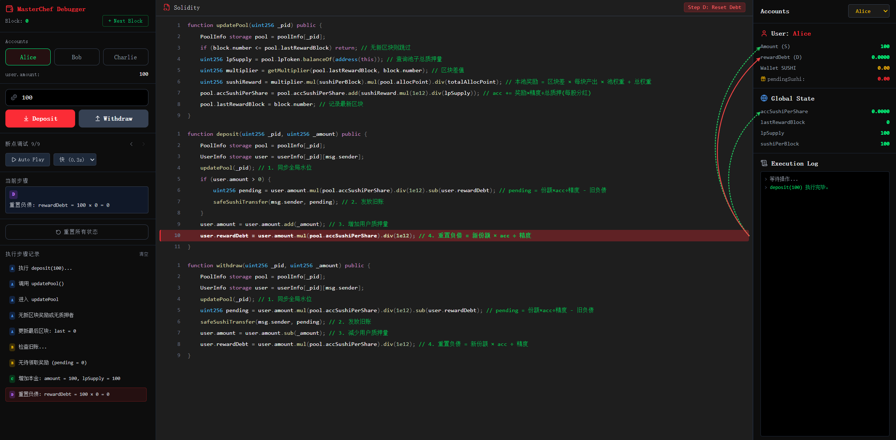
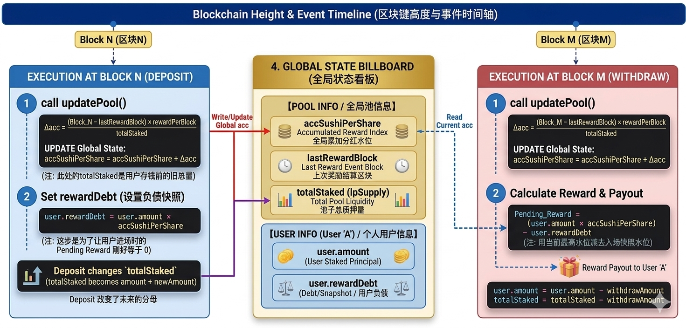

# SushiSwap MasterChef Playground

交互式 SushiSwap MasterChef 合约调试器，通过可视化方式理解 DeFi 质押奖励分配的底层数学原理。


运行截图




架构图




## 功能

- **断点调试** — 将 deposit/withdraw 操作拆解为 A→B→C→D 四个步骤，逐行执行并高亮对应 Solidity 代码
- **自动播放** — 自动逐步播放执行流程，支持调速（0.3s / 0.7s / 1.2s）
- **多账户模拟** — Alice / Bob / Charlie 三个钱包，直观展示奖励稀释效果
- **区块推进** — Next Block 按钮模拟区块增长，观察累积器变化
- **实时状态面板** — 全局变量 (`accSushiPerShare`, `lpSupply`, `lastRewardBlock`) 和用户变量 (`amount`, `rewardDebt`, `wallet`) 同步展示

## 技术栈

- React 18 + TypeScript + Vite
- TailwindCSS
- Framer Motion（动画）
- Lucide React（图标）

## 快速开始

```bash
npm install
npm run dev
```

浏览器访问 `http://localhost:5173`

## 操作流程

1. 选择账户（Alice / Bob / Charlie）
2. 输入质押数量，点击 **Deposit** 或 **Withdraw**
3. 观察断点调试器逐步执行，右侧代码高亮对应行
4. 点击 **+ Next Block** 推进区块
5. 切换账户观察奖励分配变化

## 核心算法

```
pending = (user.amount × accSushiPerShare) - rewardDebt
```

每笔操作按固定顺序执行：
1. **Step A** — `updatePool()`：累加全局奖励水位
2. **Step B** — 结算旧账：计算并发放待领取奖励
3. **Step C** — 更新本金：修改用户 amount 和池子 lpSupply
4. **Step D** — 重置负债：刷新 rewardDebt 快照
